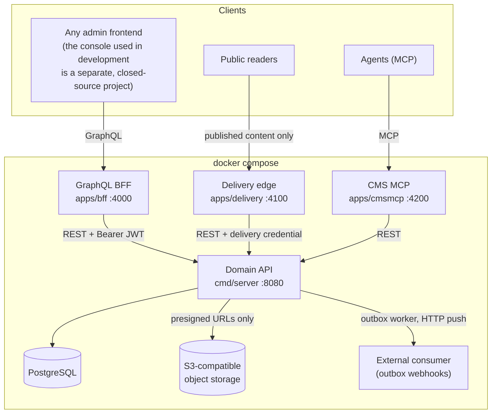

# Architecture

SaaSForge is a **modular monolith**: one Go module, one primary deployable, and hard
seams between business domains that are enforced by package layout rather than by
network boundaries. It is built so that the seams could later become services — not
so that you have to operate services today.

This document describes what is in the repository. Where something is planned but not
built, it says so.

---

## 1. Deployables

Four binaries build from this module, plus a one-shot migration runner.

| Deployable | Path | Port | Role |
|---|---|---|---|
| **Domain API** | `cmd/server` | 8080 | The application. REST under `/api/v1/*`, plus health and metrics. Assumes an authenticated caller — **not an edge service** |
| **GraphQL BFF** | `apps/bff` | 4000 | The browser-facing edge. gqlgen schema in `apps/bff/graph/`; a thin shell that speaks REST to the Domain API and never touches the database |
| **Delivery edge** | `apps/delivery` | 4100 | Public read of *published* content only. Holds its own signing key (`DELIVERY_JWT_SECRET_HEX`) and never sees `JWT_SECRET_HEX` |
| **CMS MCP server** | `apps/cmsmcp` | 4200 | The CMS exposed to agents over MCP, with agent-scoped credentials |
| **migrate** | `cmd/migrate` | — | One shot, `restart: "no"`. Applies embedded migrations, then exits |

`docker compose up` also starts Postgres, MinIO (an S3 stand-in for media), and a
mock MCP consumer used by the integration tests.



The direction of every arrow is the point: **nothing reaches Postgres except the
Domain API**, and the Domain API enforces its own rules regardless of which edge is
calling. An edge is a convenience, never a trust boundary that other components rely on.

---

## 2. The layering rule

Every business domain under `internal/` has the same three layers, and dependencies
only ever point downward:

```
handler/      HTTP only: decode, call the service, encode. No business rules, no SQL.
service/      Business rules, validation, and every authorization decision.
repository/   Persistence. All SQL lives here — and only here.
domain/       Plain types. Imports nothing but the standard library and a UUID package.
```

Three invariants hold across the repository and are worth checking if you change
anything:

1. **No SQL outside `repository/`.** Handlers and services contain no query text.
2. **`domain/` packages import no infrastructure.** Every domain package in this
   repository imports only the standard library and `github.com/google/uuid`. This is
   what keeps business types testable without a database and free to move.
3. **No role-string comparisons in handlers.** There is no `if role == "admin"` at the
   HTTP layer; authorization is a service-layer call into one interface (below).

`internal/pkg/` holds shared infrastructure — crypto, errors, validation, authn,
authz, outbox, pagination, rate limiting, metrics, object storage — and carries no
business logic.

---

## 3. Authorization

One interface, `authz.Authorizer`, is the single decision point. It has three
implementations selected by `AUTHZ_MODE`:

| Mode | Implementation | Use |
|---|---|---|
| `allow` | `allow_all.go` | Local development only. Every check passes |
| `rbac` | `rbac_authorizer.go` | Roles and permissions from the database |
| `opa` | `opa_authorizer.go` | Rego policies under `internal/pkg/authz/policies/`, `//go:embed`ed into the binary |

The database stores authorization *facts* — who holds which role in which tenant. The
*decision* is made in one place, by the configured authorizer. Two parallel sources of
authorization truth drift apart; there is deliberately only one.

A JWT's roles claim is a **snapshot taken at issue time**, not a source of truth. When
a policy engine is active, the roles table is authoritative.

Authentication middleware puts a `Subject` in the request context. Downstream code
trusts `authn.SubjectFromContext` and never a raw header. Missing subject is `401`;
a denied policy is `403` — an authorization failure is never disguised as a `404`.

**`allow` mode and dev auth headers refuse to start** unless you explicitly declare
`APP_ENV=development`. See [SECURITY.md](../SECURITY.md) for why the default sits at
the safe end, and [DEPLOYMENT_HARDENING.md](DEPLOYMENT_HARDENING.md) for the full
production checklist.

---

## 4. Identity and PII

PII is encrypted per field (AES-256-GCM, fresh nonce per value) before it reaches the
database. The split matters:

- **Only the repository layer holds a `crypto.FieldEncryptor`.** Ciphertext never
  leaves persistence; services and handlers see plaintext or nothing.
- **Services hold a `crypto.BlindIndexer`** — an HMAC-SHA256 keyed by
  `BLIND_INDEX_PEPPER_HEX`. This is how a service asks for "the user with this email"
  without the database ever holding a searchable copy of the email.

That second half is the part encryption alone doesn't give you: an encrypted column
cannot carry a `UNIQUE` constraint or an index, so uniqueness and lookup are enforced
on the deterministic blind-index column instead.

Passwords use Argon2id (`internal/auth/password`). Refresh tokens are stored as a
hash — the plaintext token exists only in the response that issued it.

---

## 5. The transactional outbox

Writes and the integration events they imply commit in **one** database transaction.
A separate worker (`internal/pkg/outbox`) then drains the outbox table over HTTP.

This is the alternative to calling an external system inside a write path, where the
two can disagree the moment either one fails: the row is written but the webhook never
fires, or the webhook fires and the transaction rolls back. Here, if the transaction
commits, the event will be delivered; if it rolls back, the event never existed.

Delivery is **at-least-once**, with a bounded retry budget and a dead-letter path for
rows that exhaust it. Each attempt carries:

- `X-Webhook-Delivery` — the outbox row id. A retry re-sends the *same* id, which is
  what lets a receiver deduplicate.
- `X-Webhook-Signature` — `sha256=` HMAC of the body under the endpoint's secret.

So consumers must be idempotent. There is a working one in
[`examples/webhook-consumer/`](../examples/webhook-consumer).

Mutating endpoints also accept an `Idempotency-Key` request header; a replay returns
the original result rather than creating a second row.

Watch `outbox_lag_seconds` and `outbox_pending` on `GET /metrics`.

---

## 6. Content, publishing, and media

The CMS keeps draft and published state **physically separate** rather than filtering
by a status column at read time. A published entry has its payload materialized into
a published column and companion tables; unpublishing deletes that materialization.
The consequence is the one worth having: a read path that only ever touches published
storage cannot leak a draft through a forgotten `WHERE` clause.

Public reads go through the delivery edge, which exchanges its own signing key for a
read-only credential scoped to published content. **The Domain API still authenticates
every request and still enforces published-only itself** — the edge's restraint is a
convenience, not the control.

Media bytes live in a private bucket. Neither upload nor download passes through the
API: clients get short-lived presigned URLs and talk to storage directly. Constraints
like content type and size limit are part of the signature, so a client cannot raise
them.

---

## 7. Agents as first-class clients

Agents are not a bolt-on:

- The CMS is exposed over MCP (`apps/cmsmcp`).
- Agents authenticate with their **own** credentials — scoped, revocable, and issued
  separately from user credentials — with per-agent rate limiting.
- A schema change that would break existing content becomes a **proposal**
  (`schema_proposals`) that a human answers, rather than a migration an agent applies
  unilaterally.

---

## 8. Cross-cutting conventions

**Errors.** One internal error type carries a stable machine-readable `code`, a
message, and an HTTP status (`internal/pkg/errors`). Each protocol maps from that one
type: a REST envelope, or GraphQL `extensions.code`. Clients switch on the code, never
on prose. Stack traces, SQL, and decrypted PII never appear in a response.

**Pagination.** Keyset, not offset. Cursor tokens are opaque base64url values
(`internal/pkg/pagination`); clients pass them back unmodified and must never parse or
construct one.

**Migrations.** Per-module, under `internal/*/migrations`, discovered by glob and
`//go:embed`ed into the binary — there is no mount list or generator step to keep in
sync. Migrations are additive, with `.up.sql`/`.down.sql` pairs, and are applied by
the one-shot `migrate` service.

**Decision records.** Comments throughout the code cite decisions two ways:
`ADR-004`, `ADR-013` and so on for architecture decisions, and `TKT-R2`, `TKT-R7`,
`TKT-OBX-1` for the security and reliability findings that a particular guard came
out of. Both kinds of record are kept in the private repository this one is
extracted from and are **not published** — a citation is there to say *that* a
choice was deliberate and roughly when, not to send you to a file you cannot open.

That is a deliberate trade, and it costs you something: you can see that
`ValidateRuntime` refuses to boot "TKT-R2" without being able to read what R2 was.
So the rule for this codebase is that **the citation is never load-bearing**.
Wherever the reasoning matters to someone reading the code, it is written out in
the comment itself, and the citation is a date stamp beside it. If you find a
comment where the identifier is doing the explaining, that is a bug in the comment.

**Go conventions.** `context.Context` first everywhere; constructors are `NewXxx`;
repository methods read as `ByID`, `ByEmailHash` rather than `GetXxx`; table-driven
tests for business logic.

---

## 9. Repository map

```text
apps/
  bff/          GraphQL BFF (gqlgen)
  delivery/     public read edge for published content
  cmsmcp/       MCP server exposing the CMS to agents
cmd/
  server/       the Domain API
  migrate/      one-shot migration runner
  mcp-mock/     mock consumer used by integration tests
internal/
  user/ auth/ iam/ notification/ tenant/ ticket/ platformops/
  cms/content/  headless CMS
  platform/     wiring: router, DB, startup guards
  pkg/          shared infrastructure (see §2)
    authz/policies/  Rego policies for AUTHZ_MODE=opa, embedded via //go:embed
scripts/        new-domain generator, seed-demo
examples/       webhook-consumer — a real outbox consumer
test/e2e/       end-to-end suites driving HTTP against a real Postgres
```

---

## 10. Adding a domain

```bash
make new-domain NAME=ticket
```

This scaffolds the full vertical slice — domain types, service, repository, handler,
migration — **and wires it into the router and dependency graph**. Generating files is
the easy half; the wiring is the half that usually gets skipped and then rots. Details
in [`new-domain.md`](new-domain.md) and
[`NEW_SERVICE_CHECKLIST.md`](NEW_SERVICE_CHECKLIST.md).

---

## 11. Rough edges

Stated plainly, because an architecture document that only describes the intended
shape is not much use when you are reading the actual code:

- **sqlc is used in one module, not all of them.** `internal/user` compiles its queries
  from `.sql` files via sqlc (`sqlc.yaml`). Every other repository writes SQL by hand
  against pgx. The layering rule — SQL only in `repository/` — holds everywhere; the
  *authoring* convention does not.
- **`internal/pkg/authn` imports `internal/auth/jwt`.** The rule is that shared packages
  do not depend on business modules. This is the one place it is violated: the JWT
  signer happens to live under the auth module. It is infrastructure in the wrong
  folder, not a business dependency, but it is a violation.
- **Soft delete is not universal.** Users are soft-deleted; several other modules issue
  real `DELETE` statements.
- **BFF → Domain is REST, not gRPC.** gRPC was evaluated and deferred; the interface
  boundary is drawn so it could change without touching the services behind it.
- **Single region, single Postgres.** No sharding, no read replicas, no service mesh.

---

*Pre-1.0. This document describes the code in this repository as it currently stands;
where the two disagree, the code is right and this file is a bug.*
